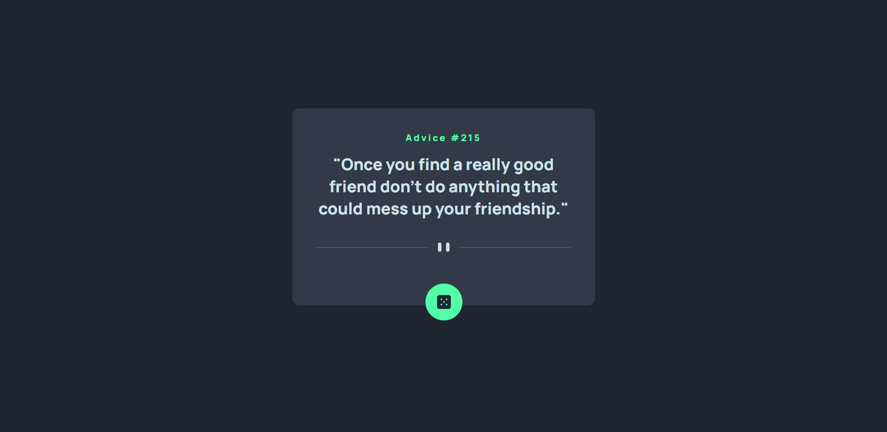
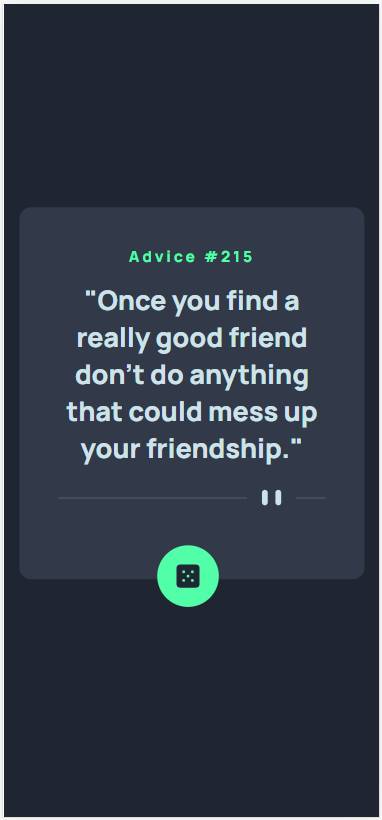

# Frontend Mentor - Advice generator app solution

This is a solution to the [Advice generator app challenge on Frontend Mentor](https://www.frontendmentor.io/challenges/advice-generator-app-QdUG-13db). Frontend Mentor challenges help you improve your coding skills by building realistic projects.

## Table of contents

- [Overview](#overview)
  - [The challenge](#the-challenge)
  - [Screenshots](#screenshots)
  - [Links](#links)
- [My process](#my-process)
  - [Built with](#built-with)
  - [What I learned](#what-i-learned)
- [Author](#author)

## Overview

### The challenge

Users should be able to:

- View the optimal layout for the app depending on their device's screen size
- See hover states for all interactive elements on the page
- Generate a new piece of advice by clicking the dice icon

### Screenshots





### Links

- Solution URL: [https://github.com/pedrommb7/advice-generator-app](https://github.com/pedrommb7/advice-generator-app)
- Live Site URL: [Add live site URL here](https://your-live-site-url.com)

## My process

### Built with

- Semantic HTML5 markup
- SCSS, BEM
- Flexbox
- Mobile-first workflow
- [React-TypeScript](https://create-react-app.dev/docs/adding-typescript/)

### What I learned

In this project I learned that the useEffect hook is used to handle side effects in functional components. A side effect is anything that affects something outside the scope of the current function, such as fetching data from an API.
The useEffect hook was used in conjunction with the useState hook to set the state of advice and adviceID based on the response.

I also learned we can set icons directly through JSX based on a certain condition. In the example below you can see I used the mediaQuery const as the condition to set the patternDivider icon in the blockquote element.

```js
useEffect(() => {
  fetch(API_URL)
    .then((response) => response.json())
    .then((data) => {
      setAdvice(data.slip.advice);
      setAdviceID(data.slip.id);
    })
    .catch((error) => console.error(error));

  const mediaQuery = window.matchMedia(mediaQueryDesktop);
  setIsDesktop(mediaQuery.matches);
  const handleChange = (event: MediaQueryListEvent) => {
    setIsDesktop(event.matches);
  };

  mediaQuery.addListener(handleChange);

  return () => {
    mediaQuery.removeListener(handleChange);
  };
}, []);
```

```html
<blockquote>
  <Heading type={"h1"} text={`"${advice}"`} /> <Svg className={`${ isDesktop ?
  "advicegenerator__patternDividerDesktop" :
  "advicegenerator__patternDividerMobile" } mb--56 mt--24`} icon={isDesktop ?
  patternDividerDesktop : patternDividerMobile} />
</blockquote>
```

## Author

- Frontend Mentor - [@pedrommb7](https://www.frontendmentor.io/profile/pedrommb7)
